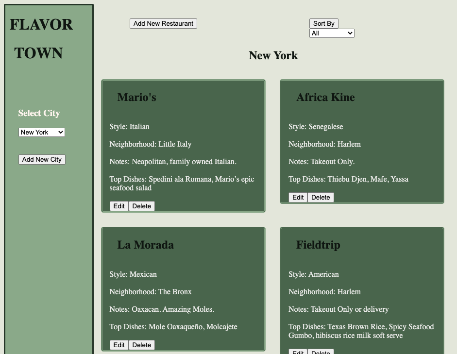

# Flavor Town

Tired of forgetting which restaurants you need to try while you're in town? Now you don't have to! Flavor Town is a single page web app where you can keep track of your must-eat restaurant destinations based on the city they're in.

## Features
* Built with just vanilla JavaScript on the frontend and a Rails API backend
* Incorporates resource filtering by city and restaurant style
* Full CRUD Functionality for list items

## Demo

[Video Walkthrough](https://drive.google.com/file/d/1xv52Q-zS8hbsRVxGX85m63s3o5UuNB3R/view?usp=sharing)

## To Install
1. Fork and clone this repository.
2. Navigate to the backend folder in your terminal.
3. Run `bundle install` in your terminal.
4. Run `rails db:migrate` in your terminal
5. Run `rails s` to start app on rails server.
6. Open the index.html file in the frontend folder, either by going into the folder directly in finder/file explorer, or from the frontend folder in your terminal by entering `open index.html`

## Contributions
Pull requests are welcome. For major changes, please open an issue first to discuss what you would like to change.

## License
[MIT License](https://github.com/J5Wood/coffee-talk/blob/master/LICENSE.md)